<div align="center">

# ShinkaLabs Skills



Skill pack for AI agents focused on audit, security, performance, robustness, and project quality.

<p>
  
  
  
  
</p>

[GitHub Repository](https://github.com/TheKazuto/ShinkaLabs-Skills)

</div>

---

## What This Pack Provides

These skills help agents review projects more rigorously, with focus on:

- user and fund safety;
- backend, frontend, and smart contract robustness;
- evidence-based performance review;
- dead code identification;
- robust fix recommendations;
- audit reports with evidence, severity, confidence, and a fix plan.

## Included Skills

| Skill | Main focus |
|---|---|
| `go-audit-optimizer` | Go/Golang backend audits |
| `rust-backend-audit-optimizer` | Rust backend audits |
| `typescript-backend-audit-optimizer` | TypeScript/Node.js backend audits |
| `typescript-frontend-audit-optimizer` | TypeScript frontend audits |
| `solana-anchor-audit-optimizer` | Solana Anchor program audits |
| `solana-quasar-audit-optimizer` | Solana Quasar program audits |
| `solana-pinocchio-audit-optimizer` | Solana Pinocchio program audits |
| `legal-audit-optimizer` | Legal, privacy, and compliance audits |

### `go-audit-optimizer`

Audits Go/Golang backend projects, APIs, workers, financial systems, queues, databases, and production services. Focuses on security, performance, robustness, concurrency, dead code, and structural quality.

### `rust-backend-audit-optimizer`

Audits Rust backend projects, APIs, workers, Tokio/Axum/Actix services, financial systems, FFI, and `unsafe` code. Focuses on security, async/concurrency, robustness, performance, dead code, and structural quality.

### `typescript-backend-audit-optimizer`

Audits TypeScript/Node.js backends using Express, NestJS, Fastify, Hono, workers, SaaS systems, multi-tenant systems, authentication, databases, and queues. Focuses on security, event-loop safety, dependency risk, performance, dead code, and production readiness.

### `typescript-frontend-audit-optimizer`

Audits TypeScript frontends using React, Next.js, Vue, Angular, Svelte, Vite, SPAs, and dashboards. Focuses on XSS, token handling, runtime validation, accessibility, privacy, performance, build safety, dead code, and structural quality.

### `solana-anchor-audit-optimizer`

Audits Solana programs built with Anchor. Focuses on constraints, PDAs, CPI, SPL Token/Token-2022, `remaining_accounts`, IDL, account lifecycle, arithmetic, compute units, deploy readiness, and Sealevel risks.

### `solana-quasar-audit-optimizer`

Audits Solana programs built with Quasar. Focuses on account validation, PDAs, CPI, zero-copy, `unsafe`, Token-2022, discriminators, account layout, compute units, dead code, and deploy readiness.

### `solana-pinocchio-audit-optimizer`

Audits Solana programs built with Pinocchio and low-level/native patterns. Focuses on manual account validation, buffer parsing, zero-copy, `unsafe`, p-token, SPL Token/Token-2022, PDAs, CPI, compute units, and differential tests.

### `legal-audit-optimizer`

Audits legal and compliance readiness for websites, apps, and digital projects. Helps identify missing terms, policies, notices, consent flows, privacy elements, cookies, LGPD/GDPR/CCPA gaps, accessibility concerns, and other elements that may create legal risk.

## Installation

Each skill is a folder containing a `SKILL.md` file. To install the pack, copy the skill folders into your agent's skills directory.

### Codex Installation

1. Clone the repository:

```bash
git clone https://github.com/TheKazuto/ShinkaLabs-Skills.git
```

2. Copy the skills into the Codex skills folder.

Windows:

```powershell
Copy-Item -Recurse ".\ShinkaLabs-Skills\*" "$env:USERPROFILE\.codex\skills\"
```

macOS/Linux:

```bash
cp -R ./ShinkaLabs-Skills/* ~/.codex/skills/
```

3. Restart the agent or reload skills if your environment requires it.

### Other Agents

For agents compatible with local skills:

1. Open the agent's skills configuration folder.
2. Copy the desired skill folders.
3. Make sure each skill keeps this structure:

```text
skill-name/
`-- SKILL.md
```

4. Restart or reload the agent.

## Usage

After installation, skills can activate automatically when the user's request matches the skill description, or manually by name.

Examples:

```text
Use the go-audit-optimizer skill to audit this Go backend.
```

```text
Use the solana-anchor-audit-optimizer skill to review this Anchor program.
```

```text
Use the legal-audit-optimizer skill to check whether this website has legal risks.
```

## Expected Audit Format

These skills are designed to guide the agent toward delivering:

- executive snapshot;
- reviewed scope;
- list of findings;
- severity and confidence for each finding;
- concrete evidence;
- impact explanation;
- robust recommended solution;
- fast mitigation when useful;
- commands, tests, or validation steps to prove the fix;
- risk-ordered fix plan.

## License

MIT
