<div align="center">

# ShinkaLabs Skills



Pack de skills para agentes de IA focado em auditoria, segurança, performance, robustez e qualidade de projetos.

<p>
  
  
  
  
</p>

[Repositório no GitHub](https://github.com/TheKazuto/ShinkaLabs-Skills)

</div>

---

## O que este pack oferece

Estas skills ajudam agentes a revisar projetos de forma mais rigorosa, com foco em:

- segurança de usuários e fundos;
- robustez de backend, frontend e contratos;
- performance baseada em evidência;
- identificação de código morto;
- recomendações de correção robustas;
- relatórios de auditoria com evidência, severidade, confiança e plano de correção.

## Skills incluídas

| Skill | Foco principal |
|---|---|
| `go-audit-optimizer` | Auditoria de backends Go/Golang |
| `rust-backend-audit-optimizer` | Auditoria de backends Rust |
| `typescript-backend-audit-optimizer` | Auditoria de backends TypeScript/Node.js |
| `typescript-frontend-audit-optimizer` | Auditoria de frontends TypeScript |
| `solana-anchor-audit-optimizer` | Auditoria de programas Solana Anchor |
| `solana-quasar-audit-optimizer` | Auditoria de programas Solana Quasar |
| `solana-pinocchio-audit-optimizer` | Auditoria de programas Solana Pinocchio |
| `legal-audit-optimizer` | Auditoria jurídica, privacidade e compliance |

### `go-audit-optimizer`

Auditoria de projetos Go/Golang backend, APIs, workers, sistemas financeiros, filas, bancos de dados e serviços de produção. Foca em segurança, performance, robustez, concorrência, código morto e qualidade estrutural.

### `rust-backend-audit-optimizer`

Auditoria de projetos Rust backend, APIs, workers, serviços Tokio/Axum/Actix, sistemas financeiros, FFI e código `unsafe`. Foca em segurança, async/concurrency, robustez, performance, código morto e qualidade estrutural.

### `typescript-backend-audit-optimizer`

Auditoria de backends TypeScript/Node.js com Express, NestJS, Fastify, Hono, workers, SaaS, sistemas multi-tenant, autenticação, bancos de dados e filas. Foca em segurança, event loop, dependências, performance, código morto e produção.

### `typescript-frontend-audit-optimizer`

Auditoria de frontends TypeScript em React, Next.js, Vue, Angular, Svelte, Vite, SPAs e dashboards. Foca em XSS, tokens, validação runtime, acessibilidade, privacidade, performance, build safety, código morto e qualidade estrutural.

### `solana-anchor-audit-optimizer`

Auditoria de programas Solana no framework Anchor. Foca em constraints, PDAs, CPI, SPL Token/Token-2022, `remaining_accounts`, IDL, account lifecycle, aritmética, compute units, deploy readiness e riscos Sealevel.

### `solana-quasar-audit-optimizer`

Auditoria de programas Solana no framework Quasar. Foca em validação de contas, PDAs, CPI, zero-copy, `unsafe`, Token-2022, discriminators, account layout, compute units, código morto e deploy readiness.

### `solana-pinocchio-audit-optimizer`

Auditoria de programas Solana no framework Pinocchio e padrões low-level/native. Foca em validação manual de contas, parsing de buffers, zero-copy, `unsafe`, p-token, SPL Token/Token-2022, PDAs, CPI, compute units e testes diferenciais.

### `legal-audit-optimizer`

Auditoria jurídica e de compliance para sites, apps e projetos digitais. Ajuda a identificar ausência de termos, políticas, avisos, consentimentos, privacidade, cookies, LGPD/GDPR/CCPA, acessibilidade e outros elementos que podem gerar risco jurídico.

## Como instalar

Cada skill é uma pasta contendo um arquivo `SKILL.md`. Para instalar, copie as pastas das skills para o diretório de skills do seu agente.

### Instalação no Codex

1. Clone o repositório:

```bash
git clone https://github.com/TheKazuto/ShinkaLabs-Skills.git
```

2. Copie as skills para a pasta de skills do Codex.

Windows:

```powershell
Copy-Item -Recurse ".\ShinkaLabs-Skills\*" "$env:USERPROFILE\.codex\skills\"
```

macOS/Linux:

```bash
cp -R ./ShinkaLabs-Skills/* ~/.codex/skills/
```

3. Reinicie o agente ou recarregue as skills, se o seu ambiente exigir.

### Instalação em outros agentes

Para agentes compatíveis com skills locais:

1. Abra a pasta de configuração de skills do agente.
2. Copie as pastas das skills desejadas.
3. Garanta que cada skill mantenha esta estrutura:

```text
skill-name/
`-- SKILL.md
```

4. Reinicie ou recarregue o agente.

## Como usar

Depois de instaladas, as skills podem ser ativadas automaticamente quando o pedido do usuário combina com a descrição da skill, ou manualmente pelo nome.

Exemplos:

```text
Use a skill go-audit-optimizer para auditar este backend Go.
```

```text
Use a skill solana-anchor-audit-optimizer para revisar este programa Anchor.
```

```text
Use a skill legal-audit-optimizer para verificar se este site possui riscos jurídicos.
```

## Formato esperado das auditorias

As skills foram desenhadas para orientar o agente a entregar:

- resumo executivo;
- escopo revisado;
- lista de problemas encontrados;
- severidade e confiança de cada achado;
- evidência concreta;
- impacto do problema;
- solução robusta recomendada;
- mitigação rápida quando útil;
- comandos, testes ou validações para comprovar a correção;
- plano de correção ordenado por risco.

## Licença

MIT
